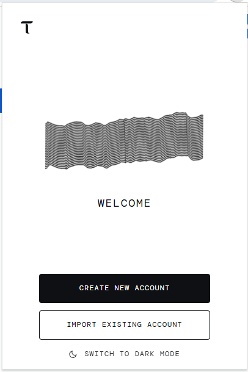
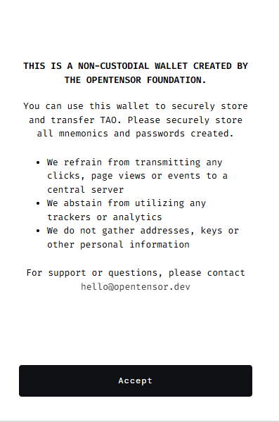
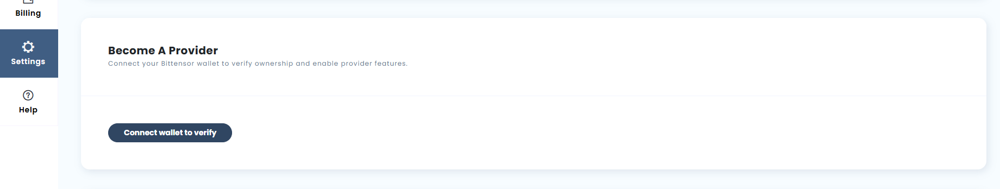
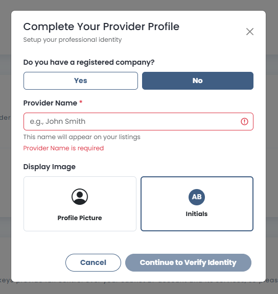
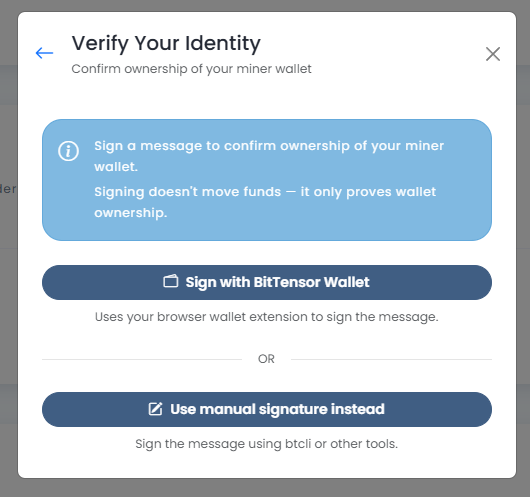
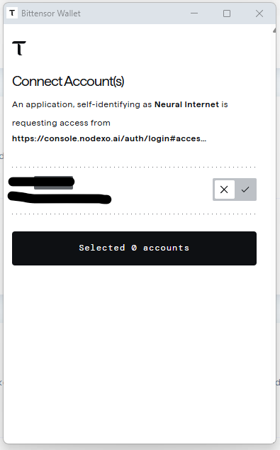
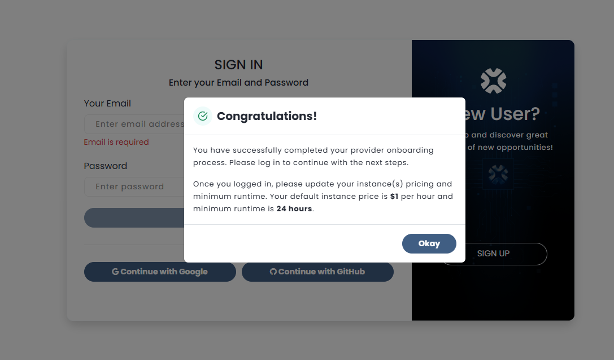
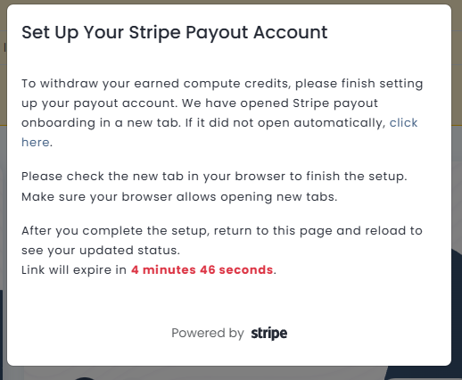

# Nodexo Provider Onboarding Guide

Welcome to **Nodexo**! This guide will walk you through the process of becoming a GPU provider on the Nodexo platform and earning rental income from your hardware.

---

## Table of Contents

1. [Overview](#overview)
2. [Prerequisites](#prerequisites)
3. [Step 1: Set Up Your Miner](#step-1-set-up-your-miner)
4. [Step 2: Create a Nodexo Account](#step-2-create-a-nodexo-account)
5. [Step 3: Install Bittensor Wallet Extension](#step-3-install-bittensor-wallet-extension)
6. [Step 4: Become a Provider](#step-4-become-a-provider)
7. [Step 5: Complete Provider Profile](#step-5-complete-provider-profile)
8. [Step 6: Verify Your Identity](#step-6-verify-your-identity)
9. [Step 7: Set Up Stripe Payout Account](#step-7-set-up-stripe-payout-account)
10. [Step 8: Configure Instance Pricing](#step-8-configure-instance-pricing)
11. [Earnings Model](#earnings-model)
12. [Frequently Asked Questions](#frequently-asked-questions)

---

## Overview

### New Rental-Based Model

Nodexo has migrated to a **rental-based compensation model**. This means:

- **Emissions are now used only for coordinating compute resources** or providing demand-based incentives
- **Miners are compensated directly from rental income** when clients rent their GPUs
- **You set your own rental prices** for your instances
- **You earn when your GPUs are actively being used**, not just for being online

This creates a more efficient market where providers are rewarded based on actual usage and demand for their hardware.

---

## Prerequisites

Before you begin, ensure you have:

- ✅ A registered and active miner on Subnet 27 (SN27)
- ✅ Your miner is properly configured and running (verify with `btcli s list`)
- ✅ The same coldkey that you used to register your miner
- ✅ Access to your Bittensor wallet mnemonic (seed phrase) or ability to sign with `btcli`
- ✅ Chrome browser (optional, for Bittensor Wallet extension)
- ✅ Valid email address
- ✅ Stripe-compatible payment method for receiving payouts

> **Important**: You must complete the miner setup first using either the [automated installer](../scripts/installation_script/README.md) or the [manual installation guide](../README.md) before proceeding with this onboarding process.

---

## Step 1: Set Up Your Miner

If you haven't already set up your miner, you have two options:

### Option A: Automated Installation (Recommended)

Use the automated installation script located in `scripts/installation_script/`:

```bash
cd SN27/scripts/installation_script
chmod +x sn27_installer.sh
./sn27_installer.sh
```

Follow the prompts to install all dependencies and configure your miner.

### Option B: Manual Installation

Follow the comprehensive guide in the [main README.md](../README.md) to:

1. Install Docker and NVIDIA drivers
2. Install Python dependencies and Bittensor
3. Create/import your wallet
4. Register your hotkey on Subnet 27
5. Configure networking and firewall
6. Launch your miner with PM2

### Verify Your Miner is Running

Before proceeding, verify your miner is active:

```bash
# Check if your miner process is running
pm2 list

# Verify your hotkey is registered on Subnet 27
btcli s list --netuid 27 --subtensor.network finney

# Check miner logs
pm2 logs <miner_name>
```

You should see:
- Your miner process showing as "online" in PM2
- Your hotkey registered with a UID on Subnet 27
- No critical errors in the logs

---

## Step 2: Create a Nodexo Account

1. **Navigate to the Nodexo Console**:

   Visit [https://console.nodexo.ai/](https://console.nodexo.ai/)

2. **Sign Up for an Account**:

   You have multiple options to create an account:
   - Email and password
   - Continue with Google
   - Continue with GitHub

3. **Sign In**:

   Once your account is created, sign in to access the console.

---

## Step 3: Install Bittensor Wallet Extension (Optional)

To verify ownership of your miner, you can use the **Bittensor Wallet** browser extension for convenient signing, or alternatively use the manual signature method in Step 6.

> **Note**: This step is optional. If you prefer to use manual signature with `btcli` or other tools, you can skip to Step 4.

### If using the Bittensor Wallet Extension:

1. **Install the Extension**:

   Visit the Chrome Web Store:
   [Bittensor Wallet Extension](https://chromewebstore.google.com/detail/bittensor-wallet/bdgmdoedahdcjmpmifafdhnffjinddgc)

   Click "Add to Chrome" to install.

   

2. **Import Your Wallet**:

   **CRITICAL**: You must import the **same coldkey** that you used to register your miner on Subnet 27.

   - Click "IMPORT EXISTING ACCOUNT"
   - Enter your mnemonic (seed phrase)
   - Set a secure password for the browser wallet
   - Click "Import"

   

> **Security Note**: The Bittensor Wallet is a non-custodial wallet created by the OpenTensor Foundation. It does not transmit clicks, page views, or personal information to any central server. Store your mnemonic securely.

---

## Step 4: Become a Provider

1. **Navigate to Settings**:

   In the Nodexo Console, click on **Settings** in the left sidebar.

2. **Click "Become a Provider"**:

   You'll see a section titled **"Become A Provider"** with the description:
   "Connect your Bittensor wallet to verify ownership and enable provider features."

   Click the **"Connect wallet to verify"** button.

   

> **Note**: This button will only allow you to proceed if you have an active, registered miner on Subnet 27. The system verifies that your hotkey is registered using `btcli s register`.

---

## Step 5: Complete Provider Profile

After clicking to become a provider, you'll see a profile setup form:



### Fill Out Your Information:

1. **Do you have a registered company?**

   Select "Yes" or "No" depending on your situation.

2. **Provider Name** (Required):

   Enter a name that will appear on your listings (e.g., "John Smith", "GPU Cloud Services", etc.)

   This is the name clients will see when browsing available GPUs.

3. **Display Image**:

   Choose how you want to represent your provider profile:
   - **Profile Picture**: Upload a custom image
   - **Initials**: Use your initials as a default avatar

4. **Continue**:

   Click **"Continue to Verify Identity"** to proceed to the next step.

---

## Step 6: Verify Your Identity

To confirm ownership of your miner wallet, you need to sign a message:



### Understanding the Verification Process:

- **Why sign a message?** This proves you own the coldkey associated with your miner
- **Does signing move funds?** No! Signing a message only proves wallet ownership; it does NOT transfer any TAO or funds
- **Is it safe?** Yes, message signing is a standard cryptographic operation that doesn't give anyone access to your funds

### Sign the Message:

You have two options:

#### Option A: Sign with BitTensor Wallet Extension (Recommended)

1. Click **"Sign with BitTensor Wallet"**
2. The Bittensor Wallet extension will open automatically
3. Review the connection request from `https://console.nodexo.ai/`
4. Select your account (the one with your coldkey)
5. Approve the signature request

   

#### Option B: Use Manual Signature

1. Click **"Use manual signature instead"**
2. Sign the message using `btcli` or other tools
3. Paste the signature into the provided field

> **Important**: Make sure you're signing with the **same coldkey** that your miner is registered with on Subnet 27.

---

## Step 7: Set Up Stripe Payout Account

Once your identity is verified, you'll be prompted to set up your payout account:



### Congratulations!

You've successfully completed the provider onboarding process!

The confirmation modal will show:
- ✅ Your provider profile is created
- 💰 Default instance pricing: **$1 per hour**

### Set Up Stripe Payouts:



1. **Click the Stripe Link**:

   Nodexo will open a new tab to Stripe's payout onboarding process.

2. **Complete Stripe Onboarding**:

   Follow Stripe's prompts to:
   - Verify your identity
   - Add your bank account or payment details
   - Provide any required business information

3. **Return to Nodexo**:

   After completing the Stripe setup, return to the Nodexo Console tab.

   The page will automatically refresh to show your updated status.

> **Note**: The link will expire in approximately 4-5 minutes. If it expires, you can generate a new link from your settings.

---

## Step 8: Configure Instance Pricing

Now that you're a verified provider, you can customize your GPU rental pricing:

1. **Navigate to My Instances**:

   In the Nodexo Console, click on the **"My Instances"** tab.

   Here you'll see all your available GPU instances that are registered from your miner.

2. **Set Your Pricing**:

   For each GPU instance, you can configure:

   - **Hourly Rate**: The price clients pay per hour to rent your GPU (default: $1/hour)

3. **Important Pricing Notes**:

   - **You can change prices at any time**, even while an instance is currently being rented
   - **Price changes only take effect when the instance becomes available** (after the current rental ends)
   - If your GPU is actively rented, the new pricing will apply to the next rental, not the current one

4. **Consider Your Pricing Strategy**:

   - Research market rates for similar GPU models
   - Consider your hardware capabilities (VRAM, compute performance)
   - Balance competitive pricing with profitability
   - Higher-end GPUs (H100, A100) can command premium rates

5. **Save Your Changes**:

   Update and save your pricing configuration.

---

## Earnings Model

### How You Get Paid

With Nodexo's rental-based model:

1. **Client Rents Your GPU**:

   When a client selects and rents your GPU instance, the rental charges are deducted from their Nodexo account balance.

2. **You Earn Balance**:

   After the rental period ends (when the client deallocates the instance), the earnings are added to your Nodexo account balance based on your configured hourly rate.

3. **Withdraw Your Earnings**:

   You can withdraw your accumulated balance to your bank account via Stripe at any time through the Nodexo Console.

4. **Emissions for Coordination**:

   Bittensor emissions on Subnet 27 are now used primarily for:
   - Coordinating compute resources across the network
   - Providing demand-based incentives
   - Maintaining network infrastructure

### Maximizing Your Earnings

To maximize your rental income:

- ✅ Keep your miner online and running 24/7
- ✅ Ensure all ports are properly configured and accessible
- ✅ Maintain competitive pricing for your GPU tier
- ✅ Provide high-performance hardware with good uptime

---

## Frequently Asked Questions

### Q: Do I still need to be registered on Subnet 27?

**A:** Yes! You must maintain an active registration on Subnet 27 to participate in the Nodexo network. The blockchain registration is what validates your miner.

### Q: What happened to emission-based rewards?

**A:** Emissions are now used primarily for coordinating compute resources and demand incentives, not direct miner compensation. You earn directly from rental income when clients use your GPUs.

### Q: Can I set different prices for different GPUs?

**A:** Yes! If you're running multiple GPUs, you can set individual pricing for each instance based on its capabilities.

### Q: What if my miner goes offline?

**A:** If your miner is offline or unreachable, it won't appear in the available instances for clients to rent. You'll only earn when your GPUs are online and being actively rented.

### Q: How do I withdraw my earnings?

**A:** Your earnings accumulate as balance in your Nodexo account. You can withdraw this balance to your bank account via Stripe at any time through the Nodexo Console.

### Q: Do I need to pay registration costs still?

**A:** Yes, you still need TAO to register your hotkey on Subnet 27. Check current registration costs at [TaoStats](https://taostats.io/subnets/netuid-27/#registration).

### Q: What if I use a different coldkey than my miner?

**A:** The verification process will fail. You **must** use the same coldkey that your miner is registered with on Subnet 27.

### Q: Can I change my pricing later?

**A:** Yes! You can adjust your hourly rates at any time through the Nodexo Console.

---

## Next Steps

Once you've completed the onboarding process:

1. ✅ Monitor your instances in the Nodexo Console
2. ✅ Keep your miner software updated (use `--auto-update` flag)
3. ✅ Join the Discord community for updates and support
4. ✅ Optimize your pricing based on market demand
5. ✅ Ensure 24/7 uptime for maximum earning potential

**Welcome to the Nodexo provider network! Your GPU compute power is now available for rent on the decentralized marketplace.**

---

*Last Updated: January 2025*
